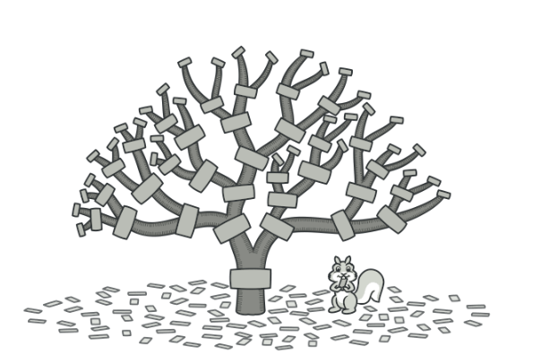
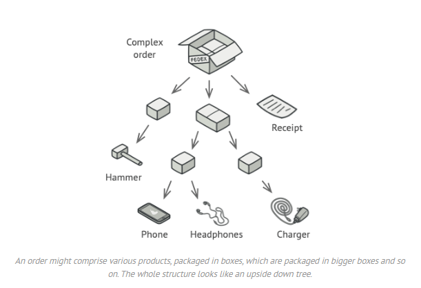
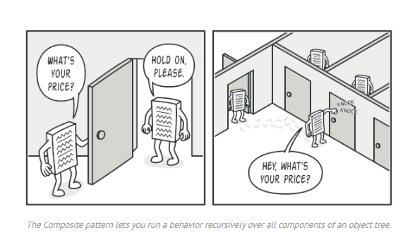
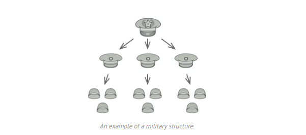
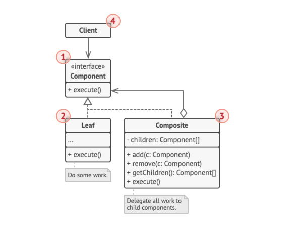
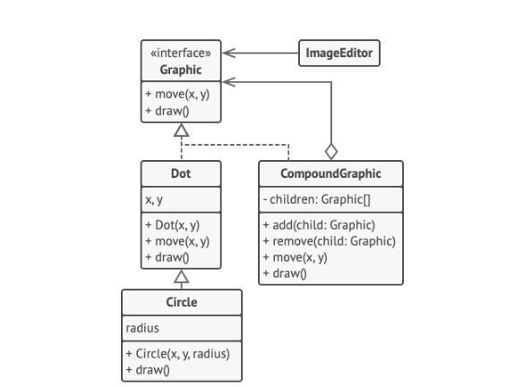

# Composite
Còn được gọi là: Object Tree

## Intent
Composite là một structural design pattern cho phép bạn kết hợp các đối tượng thành cấu trúc dạng cây (tree structure) 
và làm việc với các cấu trúc đó như thể chúng là một đối tượng đơn lẻ.

## Problem
Việc sử dụng Composite pattern chỉ hợp lý khi mô hình cốt lõi của ứng dụng có thể biểu diễn dưới dạng cây (tree).

Ví dụ: giả sử bạn có hai loại đối tượng: Products (Sản phẩm), Boxes (Hộp). 
Một Box có thể chứa nhiều Products hoặc nhiều Box nhỏ hơn. Những Box nhỏ này cũng có thể chứa các Products hoặc các Box nhỏ hơn nữa. 
Quá trình này có thể tiếp tục lặp lại nhiều lần.

Giả sử bạn xây dựng một hệ thống đặt hàng (ordering system) sử dụng các lớp này. 
Một Order có thể chứa sản phẩm đơn lẻ không đóng gói, các hộp chứa sản phẩm các hộp lớn chứa các hộp nhỏ hơn. 
Câu hỏi đặt ra là làm thế nào để tính tổng giá trị của đơn hàng?

Bạn có thể thử cách tiếp cận trực tiếp: mở tất cả các hộp, duyệt qua tất cả các sản phẩm và sau đó tính tổng. 
Điều này có thể thực hiện được trong thế giới thực; nhưng trong chương trình thì không đơn giản chỉ là chạy một vòng lặp. 
Bạn phải biết trước các lớp Product và Box mà bạn đang duyệt qua, mức độ lồng nhau của các hộp và nhiều chi tiết khó chịu khác. 
Tất cả những điều này khiến cách tiếp cận trực tiếp trở nên quá phức tạp hoặc thậm chí không thể thực hiện.

## Solution
Composite pattern gợi ý rằng bạn nên làm việc với Products và Boxes thông qua một interface chung, interface này khai 
báo một phương thức để tính tổng giá.

Phương thức này sẽ hoạt động như thế nào? Đối với một product, nó chỉ đơn giản trả về giá của sản phẩm. 
Đối với một box, nó sẽ duyệt qua từng item mà box chứa, hỏi giá của từng item và sau đó trả về tổng giá của box đó. 
Nếu một item là một box nhỏ hơn, box đó cũng sẽ bắt đầu duyệt qua các nội dung của nó và cứ tiếp tục như vậy cho đến khi 
giá của tất cả các thành phần bên trong được tính xong. Một box thậm chí có thể cộng thêm một số chi phí vào giá cuối 
cùng, chẳng hạn như chi phí đóng gói.

Lợi ích lớn nhất của cách tiếp cận này là bạn không cần quan tâm đến các lớp cụ thể của các đối tượng tạo nên cây. 
Bạn không cần biết một đối tượng là một product đơn giản hay một box phức tạp. Bạn có thể xử lý tất cả chúng giống nhau 
thông qua interface chung. Khi bạn gọi một phương thức, chính các đối tượng sẽ truyền yêu cầu xuống dưới cây.

## Real-World Analogy

Quân đội của hầu hết các quốc gia được tổ chức theo dạng phân cấp. Một quân đội bao gồm nhiều sư đoàn; một sư đoàn gồm 
nhiều lữ đoàn; một lữ đoàn gồm nhiều trung đội; các trung đội có thể được chia thành các tiểu đội. Cuối cùng, một 
tiểu đội là một nhóm nhỏ các binh sĩ. Mệnh lệnh được đưa ra ở cấp cao nhất của hệ thống phân cấp và được truyền xuống 
từng cấp cho đến khi mỗi binh sĩ đều biết mình cần làm gì.

## Structure

1. Component interface mô tả các thao tác chung cho cả các phần tử đơn giản và phức tạp trong cây.

2. Leaf là một phần tử cơ bản của cây không có phần tử con.

3. Thông thường các leaf component sẽ thực hiện phần lớn công việc thực tế vì chúng không có ai để ủy quyền công việc.

   Container (còn gọi là composite) là phần tử có các phần tử con: leaf hoặc các container khác. Một container 
   không biết lớp cụ thể của các phần tử con của nó. Nó làm việc với tất cả các phần tử con chỉ thông qua component interface.
   
   Khi nhận được một request, container sẽ ủy quyền công việc cho các phần tử con của nó, xử lý các kết quả trung 
   gian và sau đó trả về kết quả cuối cùng cho client.

4. Client làm việc với tất cả các phần tử thông qua component interface. Kết quả là client có thể làm việc theo cùng một cách với cả các phần tử đơn giản hoặc các phần tử phức tạp của cây.

## Pseudocode
Trong ví dụ này, Composite pattern cho phép bạn triển khai việc xếp chồng các hình học trong một trình chỉnh sửa đồ họa.

Lớp CompoundGraphic là một container có thể chứa bất kỳ số lượng hình dạng con nào, bao gồm cả các compound shape khác. 
Một compound shape có cùng các phương thức như một shape đơn giản. Tuy nhiên, thay vì tự thực hiện hành động, compound 
shape sẽ truyền request theo cách đệ quy đến tất cả các phần tử con và “cộng dồn” kết quả.

Code phía client làm việc với tất cả các shape thông qua một interface duy nhất chung cho tất cả các lớp shape. 
Do đó client không biết liệu nó đang làm việc với một shape đơn giản hay một compound shape. Client có thể làm việc với 
các cấu trúc đối tượng rất phức tạp mà không bị phụ thuộc vào các lớp cụ thể tạo nên cấu trúc đó.